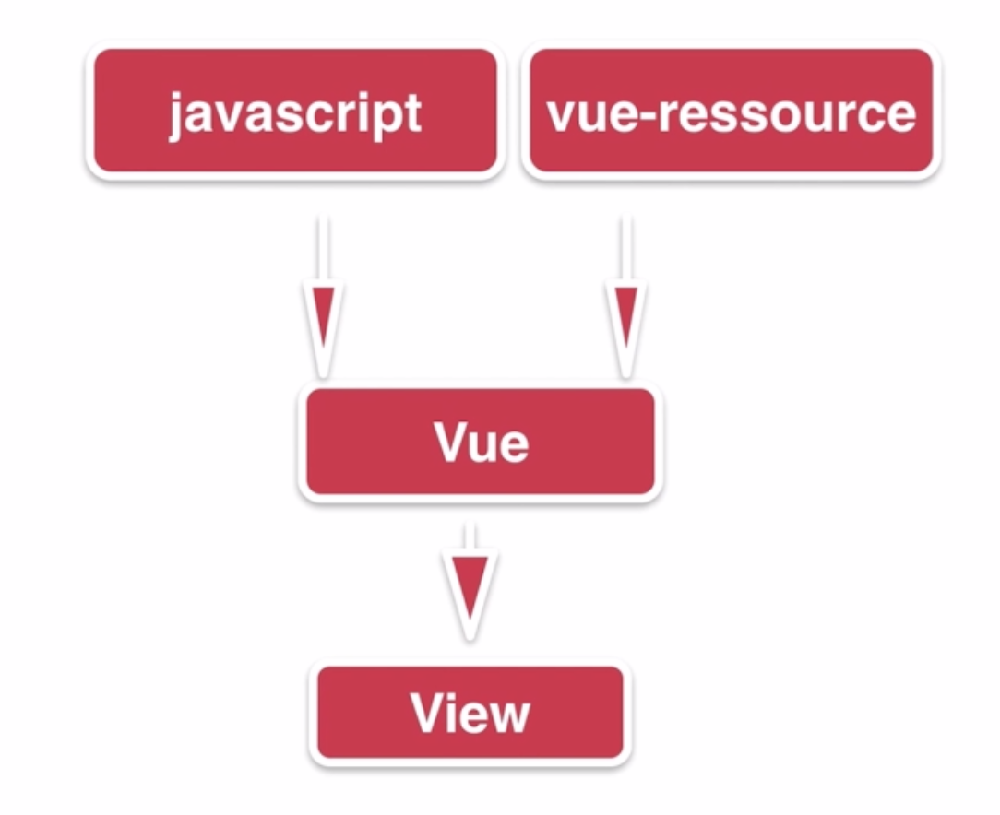

## Vue实现购物车和地址选配功能
#### Vue基础知识

1. Vue特性
  * 易用
  ```html
  <div id="app">
    {{message}}
  </div>
  ```
  ```js
  var app = new Vue({
    el: '#app',
    data: {
      message: 'Hello Vue!'
    }
  })
  ```
  ```html
  Hello Vue!
  ```
  * 灵活
  
  * 高效
    * 16kb min+gzip的运行大小
    * 超快的虚拟DOM
    * 最省心的优化
2. Vue基础指令
  * v-model
  * v-text
  * v-show
  * v-if
  * v-bind
  * v-for
  * v-on
3. 过滤器filter
4. 组件Component  
#### 购物车功能案例实现
1.  创建一个Vue的实例
```js
// new Vue({}) 可以直接new
var vm = new Vue({
  el: "#app",
  data: {
    title: "Hello, Vue"
  },
  mounted: function () { // Vue 1.0 -> 2.0 ready -> mounted
      this.cartView();
  },
  filters: { // 局部过滤器

  },
  methods: {
    add: function () {

    },
    cartView: function () {
      this.title = "cartView"
    }
  }
});

// Vue.filter(); // 全局过滤器
```
2.  通过v-for指令渲染产品数据
```js
var vm = new Vue({
  el: "#app",
  data: {
    totalMoney: 0,
    productList: []
  },
  filters: {

  },
  mounted: function () {
    this.cartView();
  },
  methods: {
    cartView: function() {
      var _this = this;
      this.$http.get("localhost:8080/cart", {"id": 123})
        .then(function(res) {
          _this.productList = res.body.result.list;
          _this.totalMoney = res.body.result.totalMoney;
          // console.log(res);
        })
    }
  }
})
```
```html
<li v-for="{item, index} in productList">
  <!-- 商品名称 -->
  <div class="cart-item-title">
      <div class="item-name">{{item.productName + "===" + index}}</div>
  </div>
</li>  
```
3.  使用Filter对金额和图片进行格式化
```js
filters: {
    formatMoney: function (value) {
      return "¥ " + value.toFixed(2);
    }
  },
```
```html
<!-- | 使用过滤器 -->
<div class="cart-tab-2">
    <div class="item-price">{{item.productPrice | formatMoney}}</div>
</div>
```
4.  使用v-on实现产品金额的动态计算

5.  综合演示
#### 地址列表功能案例实现
1. 通过v-for指令渲染地址数据以及数组过滤
2. 地址卡片选择
3. 综合演示
#### 课程总结
1. 学会如何创建一个Vue实例
2. 指令: v-model v-text v-show v-if v-bind v-for v-on
3. 过滤器的使用、computed使用
4. 结合指令和API灵活开发项目